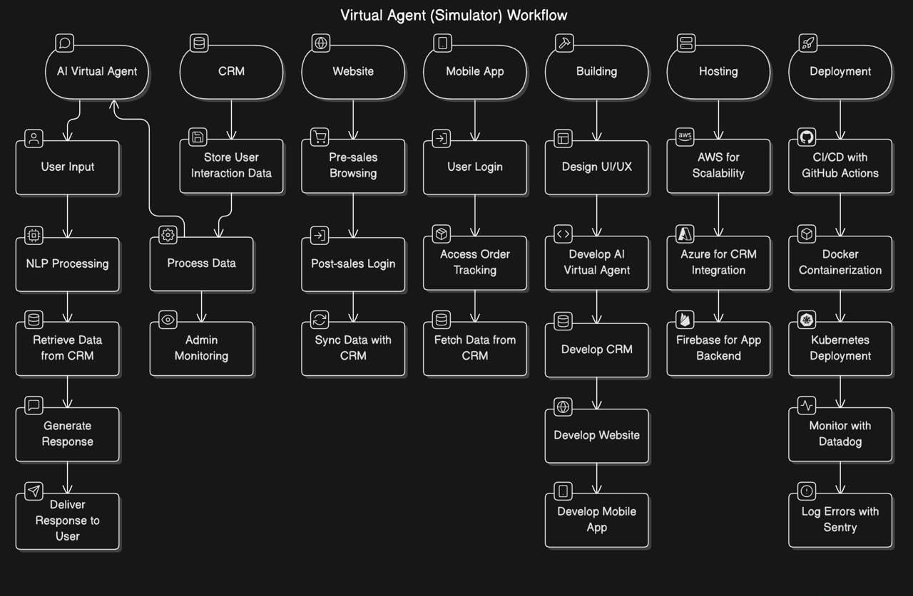

# Virtual Agent (Simulator) Documentation

## 1. Introduction
The Virtual Agent project, also known as the Simulator, is designed to revolutionize customer interactions by integrating AI capabilities with CRM systems, websites, and mobile applications. This documentation covers the process from building to deployment, providing a comprehensive guide to its implementation.

## 2. Project Overview
The Virtual Agent ecosystem includes the following key components:

### AI Virtual Agent
- **Features:**
  - Natural Language Processing (NLP) for understanding user queries.
  - Integration with CRM for personalized responses.
  - 24/7 availability for customer support.

### CRM (Customer Relationship Management)
- **Features:**
  - Centralized customer data storage.
  - Integration with AI Virtual Agent and website.
  - Real-time updates for customer interactions.

### Website
- **Features:**
  - Pre-sales: Product browsing, queries, and information.
  - Post-sales: Order tracking, support, and feedback.
  - Login and Sign-up functionality.

### Mobile App
- **Features:**
  - Post-sales support only.
  - Login functionality for personalized access.

## 3. Entities and Workflows

### 3.1 AI Virtual Agent
- **Workflow:**
  1. User inputs a query via text or voice.
  2. NLP model processes the input and retrieves relevant data from the CRM.
  3. Response is generated and delivered to the user.

### 3.2 CRM
- **Workflow:**
  1. Data from user interactions is stored and processed.
  2. AI Virtual Agent retrieves data for queries.
  3. Admins monitor and update records as needed.

### 3.3 Website
- **Workflow:**
  1. Pre-sales users browse products and services.
  2. Post-sales users log in for support and updates.
  3. Data is synced with CRM for unified management.

### 3.4 Mobile App
- **Workflow:**
  1. Users log in to access order tracking and support.
  2. Data is fetched from the CRM.

## 4. Modus Operandi: Building to Deployment

### 4.1 Building
- **Design:**
  - UI/UX for website and app.
  - Conversational flow for Virtual Agent.
- **Development:**
  - AI Virtual Agent: Python, TensorFlow, or PyTorch.
  - CRM: Salesforce or a custom-built solution.
  - Website: Use React.js and Node.js, or opt for Next.js for a unified framework that handles both frontend and backend seamlessly.
  - Mobile App: Flutter (To efficiently develop applications for both iOS and Android platforms simultaneously).

### 4.2 Hosting
- **Platform:**
  - AWS for scalability.
  - Azure for CRM integration.
  - Firebase for app backend.

### 4.3 Deployment
- **CI/CD Tools:**
  - GitHub Actions for automated pipelines.
  - Docker for containerization.
- **Monitoring:**
  - Datadog for performance tracking.
  - Sentry for error logging.

## 5. Technical Details

### 5.1 Domain
- Customer service, support automation, and post-sales engagement.

### 5.2 Hosting
- AWS and Firebase for reliability and scalability.

### 5.3 Tech Stack
- **Frontend:** React.js, Flutter.
- **Backend:** Node.js, Python.
- **AI:** TensorFlow, Hugging Face models.

### 5.4 Database
- MongoDB for CRM.
- Firebase Realtime Database for mobile app data.

### 5.5 Tools
- Jira for project management.
- Lucidchart for architecture diagrams.

### 5.6 Test Environment
- Selenium for UI testing.
- Postman for API testing.

## 6. Deployment Strategy
1. Build Docker images for all components.
2. Push images to a private AWS Elastic Container Registry.
3. Deploy using Kubernetes for load balancing.
4. Monitor logs and metrics using Datadog.

## 7. Conclusion
The Virtual Agent ecosystem combines advanced AI capabilities with robust CRM, website, and mobile app functionalities to streamline customer interactions and post-sales processes. This guide ensures a smooth workflow from design to deployment.
